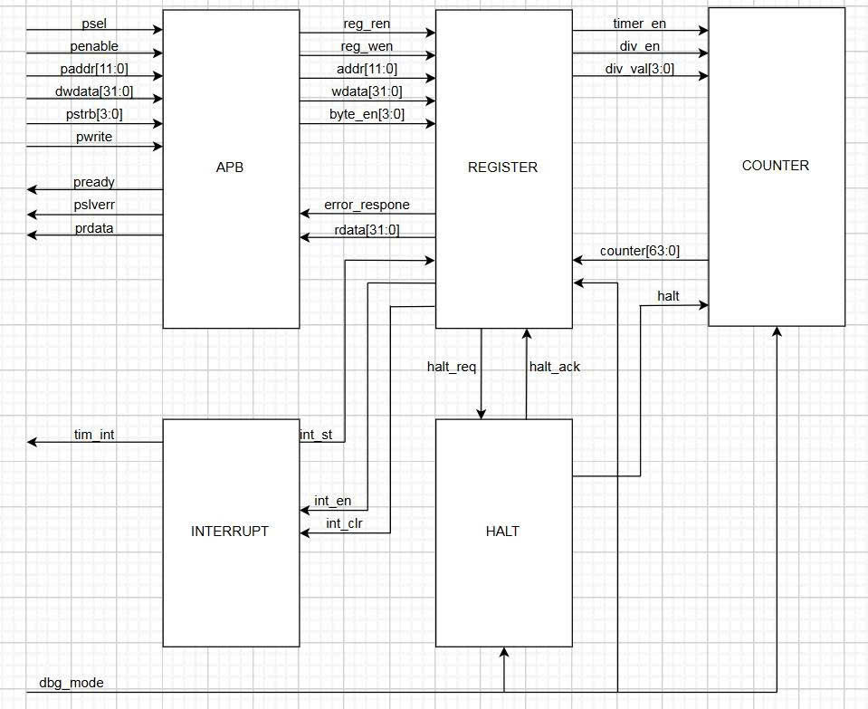

# ⏱️ Timer IP Core (RISC-V CLINT-based)

This project features the Design & Verification of a **64-bit Timer IP Core**. Inspired by the RISC-V Core Local Interruptor (CLINT) module, this IP operates as an **APB Slave** peripheral, engineered to meet stringent timing accuracy standards in modern SoC environments.

## 🚀 Key Features (Advanced Level)

The IP is designed with high-performance characteristics for optimal flexibility and system compatibility:

* **Advanced APB Protocol Support:**
    * Supports **Byte-level access** via the `pstrb` (strobe) signals.
    * Implements a 1-cycle **Wait State** for enhanced timing closure.
    * Robust **Error Handling** via `pslverr` to flag invalid access attempts.
* **Flexible 64-bit Counter:**
    * Integrated **Prescaler** supporting clock division factors from /2 up to /256.
    * Automatic reload of initial values when the counter is disabled (transition of `timer_en` from High to Low).
* **Interrupt Management:** Generates **Level-sensitive** interrupts with maskable support and a Write-1-to-Clear (W1C) mechanism.
* **Debug Mode Integration:** Supports counter freezing (Halt) when the CPU enters a Debug state.

## 🏗️ System Block Diagram

Internal connectivity components:
* **APB Interface:** Handles protocol decoding and bus data flow control.
* **Register File:** Manages configuration storage, byte-enable logic, and error detection.
* **Counter Module:** Executes the 64-bit counting logic and frequency division.
* **Interrupt/Halt Control:** Manages interrupt signal generation and emergency halt logic.

## 📋 I/O Port List

Top-level module: `timer_top`

| Signal | Width | Direction | Description |
| :--- | :---: | :---: | :--- |
| **sys_clk** | 1 | Input | System Clock |
| **sys_rst_n** | 1 | Input | Asynchronous Reset (Active Low) |
| **tim_psel** | 1 | Input | APB Slave Select |
| **tim_pwrite** | 1 | Input | Write (1) / Read (0) Control |
| **tim_penable** | 1 | Input | APB Enable signal (Access phase) |
| **tim_paddr** | 12 | Input | 12-bit Register Address |
| **tim_pwdata** | 32 | Input | Write Data Bus |
| **tim_pstrb** | 4 | Input | Byte Strobes (for Byte Access) |
| **dbg_mode** | 1 | Input | Debug Mode status from CPU |
| **tim_int** | 1 | Output | Timer Interrupt Signal |
| **tim_pready** | 1 | Output | APB Ready (Slave response) |
| **tim_pslverr** | 1 | Output | APB Slave Error |
| **tim_prdata** | 32 | Output | Read Data Bus |

## 📂 Register Map

All registers support 32-bit word or individual byte access.

| Offset | Mnemonic | Register Name | Primary Function |
| :--- | :---: | :--- | :--- |
| `0x00` | **TCR** | Timer Control | Enable/Disable and Prescaler configuration. |
| `0x04` | **TDR0** | Timer Data 0 | Lower 32-bit counter value. |
| `0x08` | **TDR1** | Timer Data 1 | Upper 32-bit counter value. |
| `0x0C` | **TCMP0** | Timer Compare 0 | Interrupt comparison (Lower 32-bit). |
| `0x10` | **TCMP1** | Timer Compare 1 | Interrupt comparison (Upper 32-bit). |
| `0x14` | **TIER** | Int Enable | Interrupt mask/enable bit. |
| `0x18` | **TISR** | Int Status | Interrupt status (Pending bit). |
| `0x1C` | **THCSR** | Halt Control | Controls freezing logic in Debug Mode. |

## 🛡️ Error Handling Specifications

The `tim_pslverr` signal is triggered under the following conditions:
1.  **Invalid Prescaler:** Attempting to write a division value (`div_val`) greater than 8 (exceeding /256).
2.  **Configuration Lock:** Attempting to modify the prescaler settings while the Timer is active.
3.  **Data Protection:** Invalid data is blocked from being committed to registers to ensure system stability.

---

## 🧪 Verification Results

The design successfully passed 40 test scenarios within the simulation environment:
- Verified correct Reset values for all registers.
- Validated Byte-level write access (Byte Enable) functionality.
- Confirmed Prescaler accuracy across the /2 to /256 range.
- Verified Interrupt logic and Write-1-to-Clear (W1C) mechanism.
- Validated Counter freezing functionality during Debug Mode.
